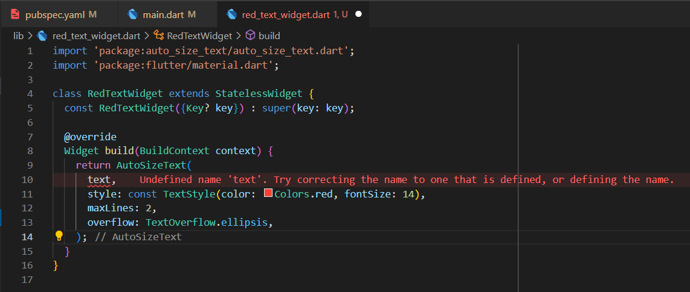
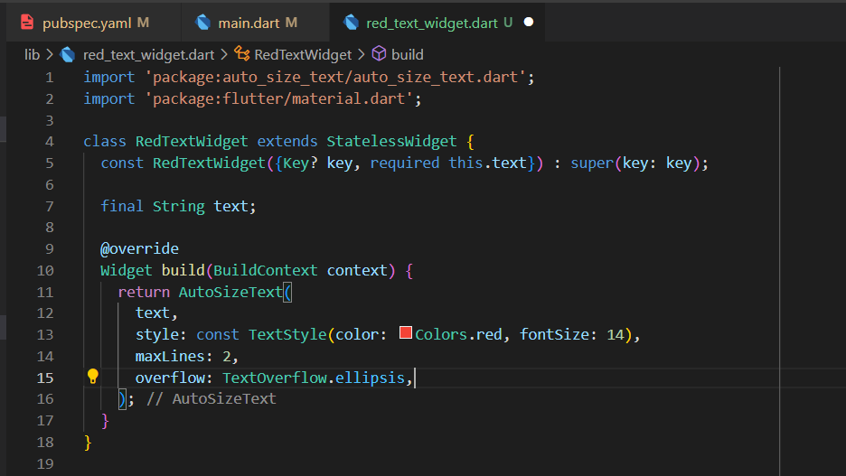
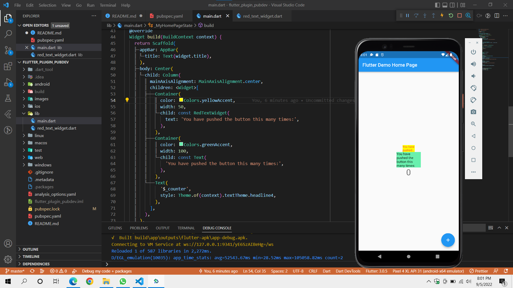

# flutter_plugin_pubdev

A new Flutter project.

## Praktikum

- Menambahkan paket AutoSizeText ke dalam project.

        flutter pub add auto_size_text

- Membuat class RedTextWidget dengan tipe Stateless di file baru.

        import 'package:flutter/material.dart';

        class RedTextWidget extends StatelessWidget {
          const RedTextWidget({Key? key}) : super(key: key);

          @override
          Widget build(BuildContext context) {
            return Container();
          }
        }

- Menambahkan widget AutoSizeText yang merupakan bagian dari paket AutoSizeText. Menambahkan parameter text dan menyesuaikan ukuran, jumlah baris, gaya teks di dalam method build dari class RedTextWidget.

  
  
  <b>Keterangan</b>
  
  Penyebab error pada baris 10 karena belum didefinisikan variabel dengan nama text di dalam class sehingga variabel dengan nama text tidak diketahui oleh program.
  
  Untuk memperbaikinya dengan cara mendefinisikan variabel-nya terlebih dahulu. Pada potongan kode dibawah di definisikan variabel baru dengan nama <b>text</b> dan tipe data String. Selain itu variabel di tambahkan keyword <b>final</b> sehingga variabel harus segera di set nilainya, untuk set nilainya dengan ditambahkan ke dalam parameter dari class konstruktor.
  
  

- Menambahkan class RedTextWidget ke dalam main.dart

      Container(
         color: Colors.yellowAccent,
         width: 50,
         child: const RedTextWidget(
                   text: 'You have pushed the button this many times:',
                ),
      ),
      Container(
          color: Colors.greenAccent,
          width: 100,
          child: const Text(
                 'You have pushed the button this many times:',
                ),
      ),
      
- Hasil akhir

  
  
  <b>Keterangan</b>
  
  Pada saat dijalankan program menampilkan 3 teks dan 1 floating action button. Pada text pertama dengan background kuning merupakan hasil teks dari widget AutoSizeText di class RedTextWidget. Sedangkan teks 2 merupakan widget Text bawaan dari flutter.
Bisa dilihat pada kedua 2 teks diatas bahwa terdapat perbedaan hasil ditampilkan. Teks pertama terlihat lebih kecil dari teks 1, dan teks 1 hanya ditampilkan sebanyak 2 baris dan terpotong dari teks aslinya. Berbeda dengan teks 2 yang memanjang kebawah mengikuti panjang dari teksnya. 

  Hal ini disebabkan karena properti <b>maxLines</b>. Maxlines merupakan properti yang bisa membatasi panjang teks yang ditampilkan sepanjang nilai di definisikan meskipun hasil teks bisa terpotong. Simbol titik merupakan simbol yang dihasilkan dari properti <b>overflow</b>, properti ini memiliki fungsi memberi maksud kepada pengguna aplikasi bahwa teks tersebut memiliki kelanjutan. Properti overflow memiliki 4 nilai utama yaitu ellipsis, fade, clip, dan visible.
  
  Untuk ukuran teks 1 yang lebih kecil dari teks merupakan hasil dari penerapan widget AutoSizeText. Widget ini membuat teks di dalamnya menyesuaikan ukuran agar pas dengan batasan yang diberikan.
  
      return AutoSizeText(
            text,
            style: const TextStyle(color: Colors.red, fontSize: 14),
            maxLines: 2,
            overflow: TextOverflow.ellipsis,
      );
      
## Tugas Praktikum

1. Selesaikan Praktikum tersebut, lalu dokumentasikan dan push ke repository Anda berupa screenshot hasil pekerjaan beserta penjelasannya di file README.md!
2. Jelaskan maksud dari langkah 2 pada praktikum tersebut!
3. Jelaskan maksud dari langkah 5 pada praktikum tersebut!
4. Pada langkah 6 terdapat dua widget yang ditambahkan, jelaskan fungsi dan perbedaannya!
5. Jelaskan maksud dari tiap parameter yang ada di dalam plugin auto_size_text berdasarkan tautan pada dokumentasi ini !

Jawaban

1. [Jawaban praktikum](#praktikum "Goto Praktikum")
2. Merupakan perintah untuk menambahkan plugin ke dalam pubspec.yaml. Perintah untuk menambahkan plugin menggunakan <b>flutter pub get</b> diikuti dengan nama paket di website pub.dev. Jika paket berhasil ditambahkan maka akan terdapat nama paket di pubspec.yaml di dalam baris dependencies disertai dengan versi paket.
3. Agar nilai dari atribut data di widget AutoSizeText berjalan dengan baik, maka perlu di definisikan dahulu nama variabel di dalam konstruktor agar nilainya bisa di set.
4. Widget Container pertama yang memiliki child dari class RedTextWidget dimana class ini mengembalikan widget AutoSizeText. Menampilkan teks dengan ukuran lebih kecil, terbatas pada 2 baris, dan tampil terpotong, sedangkan widget Container kedua yang memiliki child widget Text bawaan dari Flutter menampilkan teks dengan dengan ukuran normal dan tampil lengkap. Widget AutoSizeText membuat teks di dalamnya menyesuaikan ukuran dengan pembatasnya yaitu container dan dibatasi hanya tampil 2 baris. Sedangkan widget Text di dalam Container ke 2 tidak diberikan properti apapun sehingga ditampilkan secara default.
5. .

Parameter  | Deskripsi
------------- | -------------
Key  | Mengendalikasi sebuah widget di widget Tree
textKey  | Mengatur key untuk widget text yang dihasilkan
style  | Mengatur gaya teks yang diinginkan, seperti ukuran, warna, jenis (italic/bold)
minFontSize  | Mengatur batas minimal teks ketika mengatur teks secara otomatis
maxFontSize  | Mengatur batas maksimal teks ketika mengatur teks secara otomatis
stepGranularity  | Ukuran step di mana ukuran font disesuaikan dengan batasan.
presetFontSizes  | Mendefinisikan ukuran font yang memungkinkan
group  | Menyinkronkan ukuran dari beberapa AutoSizeText
textAlign  | Mengatur kesejajaran teks
textDirection  | Mengatur arah mulai teks. Dari kiri ke kanan atau sebaliknya
locale  | Memilih font yang memiliki karakter UNICOde yang sama tetapi di render berbeda tergantung dengan lokal
softWrap  | Mengatur apakah teks ingin dibuat baris baru jika melebihi batasan
wrapWords  | Mengatur apakah teks yang tidak pas dalam satu baris akan dibuat baris baru
overflow  | Mengatur tampilan jika melebihi batasan
overflowReplacement  | Jika teks melebihi batasan maka akan ditampilkan widget pengganti
textScaleFactor  | Jumlah piksel font untuk setiap piksel logis. Juga memengaruhi minFontSize, maxFontSize, dan presetFontSizes
maxLines  | Mengatur jumlah maksimal baris dari teks yang ditampilkan
semanticsLabel  | Teks semantik, biasa digunakan pada mesin talkback
